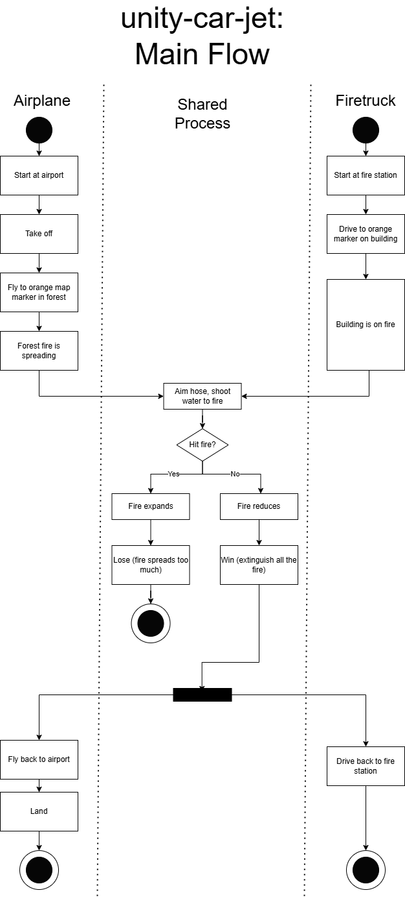
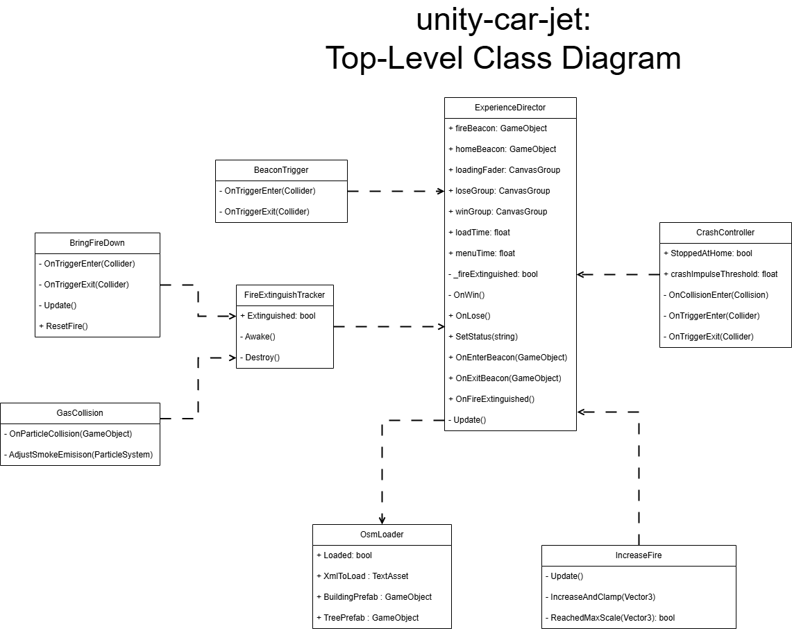

# Technical Documentation

# Architecture and Design

See our website ([car](https://xlrseatingbuck-org.github.io/unity-car.html)) ([plane](https://xlrseatingbuck-org.github.io/unity-plane.html)).

# Classes

## Project Overview

This simulation is set in a realistic 3D environment constructed using Cesium for Unity, allowing for accurate geospatial data integration. The environment was set up following the official Cesium documentation, enabling real-world terrain and building placement. The simulation supports both VR and non-VR modes, allowing users to switch seamlessly between the two.

## TitleController

Simple ui logic for handling button presses to go to the correct scene from the starting scene.

## ExperienceDirector

The top-level class for the entire project. Stores the general state of the simulation and determines what should happen next. It also tracks win/loss conditions and handles restarting or exiting the game.

## OsmLoader

Loads the OSM data, which contains information about specific points on the map (mainly buildings and forest).
This is used to place trees in the proper area, that can then be lit on fire.

## BeaconTrigger

Tracks whether a vehicle is in range of a given marker. Reports this state to the ExperienceDirector to change the status text.

## FireExtinguishTracker

Tracks the extinguished state of each fire in the simulation. Communicates with the ExperienceDirector to determine if all fires have been put out.

## CrashController

Manages collisions between the vehicle and the environment. Triggers haptic feedback to enhance realism upon impact.

## CarMovement

Main movement class for the firetruck. Gets input from controllers and applies forces to the truck via its wheels.

## JetMovement

Main movement class for the aeriel firefighter.
Gets input from controllers and applies forces to the plane. Handles all of the flight physics, including
simulating drag, calculating lift based on area of attack, and controlling steering/flaps.
Finally, this applies basic haptic vibration depending on the speed of the plane.

## HoseController

Enables movement and aiming of the firetruck hose. Controls water spray to extinguish fires.

## EnableExteng

Handles the releasing of foam from the plane.

## BringFireDown

Handles collision between water and fire, and properly extinguishing the fire.
This signals to FireExtinguishTracker when the fire is extinguished.
This also grows the fire over time, triggering a loss when it gets too big.

## GasCollision

Handles shooting foam out of the plane.
Extinguishes the fire when the foam touches the fire.
This signals to FireExtinguishTracker when the fire is extinguished.

## IncreaseFire

Similar to the behavior of BringFireDown, this grows the fire over time, triggering a loss when it gets too big.

## CameraController

Handles camera switching based on whether the user is in VR or not.
Also changes the UI appropriately to be visible in VR.

# Building and Releasing

1. Open Unity
2. Go to File > Build Profiles
3. Go to the Windows platform and click Build
4. Make a zip file from the build folder you just built to
5. [Create a new release on the repository](https://github.com/XLRSeatingBuck-Org/unity-car-jet/releases/new)

# Testing

This mirrors each item of the main activity diagram.
Everything works in the current build. If anything breaks, refer back to these cases.

| Test Case | Succeeds? | 
| --- | --- |
| Start at airport or fire station | ✅ |
| Fire beacon exists at fire | ✅ |
| Can take off airplane or leave fire station | ✅ |
| Can aim fire hose on fire truck | ✅ |
| Can fire water/foam from the fire plane or fire truck | ✅ |
| Fire expands over time | ✅ |
| You lose if fire gets too big | ✅ |
| Fire reduces when in contact with water/foam | ✅ |
| Extinguishing all the fire instructs you to fly/drive home | ✅ |
| You can fly/drive back home | ✅ |
| Crashing into a surface results in a loss | ✅ |
| You can land at the airport or pull into fire station | ✅ |

# Future Enhancements
 
While both experiences are complete and immersive, they are very much still prototypes.
Both visuals and realism could be vastly improved, given more time.
For example, the fire simulation is currently rather basic. It could be expanded to destroy things as it spreads.
Additional scenarios and factors can be added, such as weather events and turbulence.
Biometrics could be implemented into the system to read heartrate and potentially adjust difficulty to make a more pleasant experience.
The simulation could be connected to a multi-screen or multi-projector display for more immersion.
Finally, the VR mode could be expanded upon to allow controller input and cockpit interaction.
