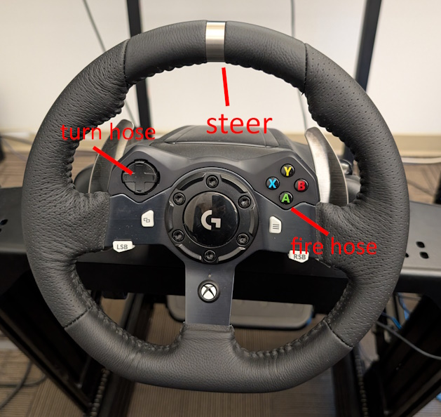
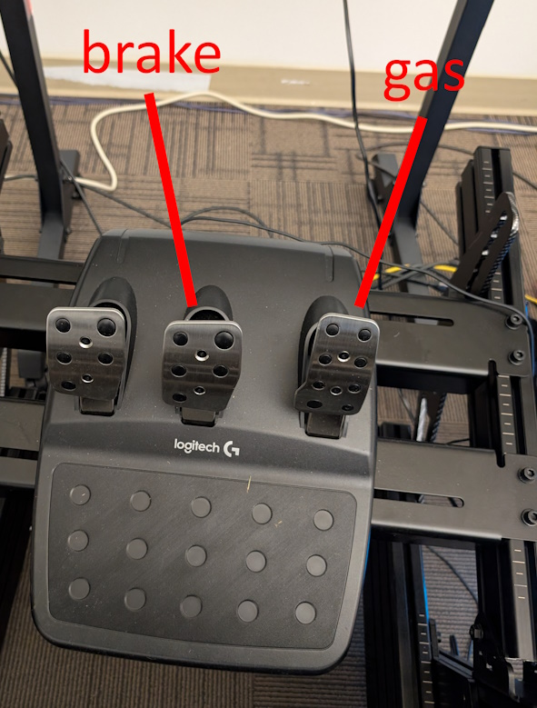
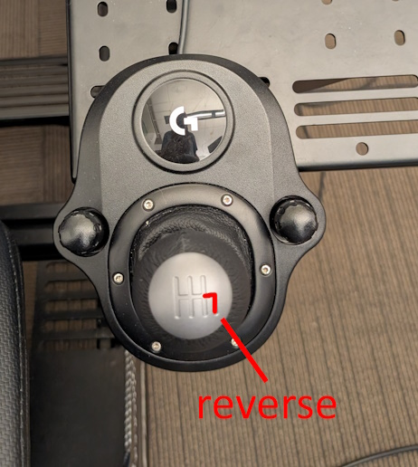
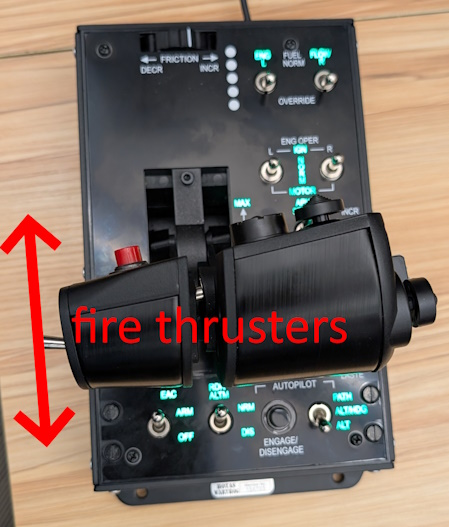
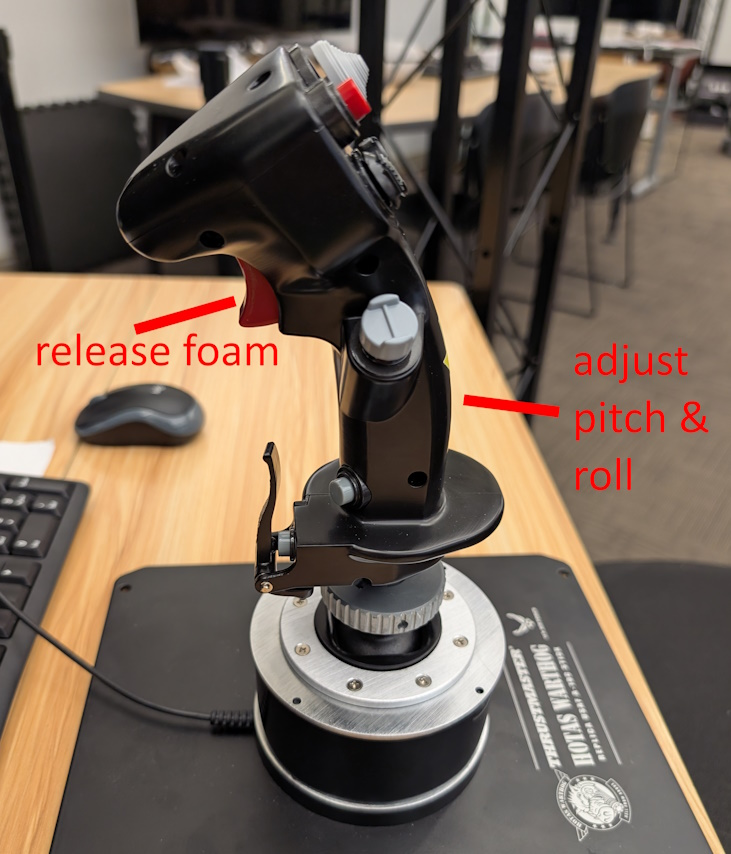
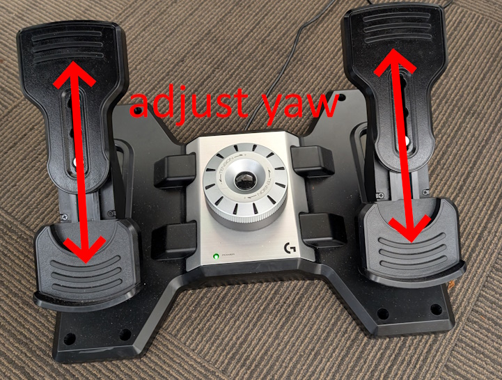

# User Manual

This document provides a brief manual of both the firetruck and plane project.

# Instructions

1. Select the experience from the main menu.
2. Follow the instructions in the bottom right corner of the screen ("STATUS: ______")
    - The main objective is to go to the fire, put it out with water or foam, and return home.
    - You will use the controls below and the STATUS to accomplish this.
3. Press Alt + F4 to quit at any time.

# Controls

## Fire Truck

### Controller

### Keyboard

| Button | Action |
| --- | --- |
| W | move forward (or reverse, if holding R) |
| S | brake |
| A | turn left |
| D | turn right |
| left arrow | move hose left |
| right arrow | move hose right |
| space | fire hose |
| R | hold to reverse |
| tab | switch camera |

## Plane

### Controller

#### Keyboard

| Button | Action |
| --- | --- |
| space | fire thrusters |
| W / S | adjust pitch |
| A / D | adjust yaw |
| Q / E | adjust roll |
| P | release foam |
| shift | hold to use airflaps |
| tab | switch camera |
